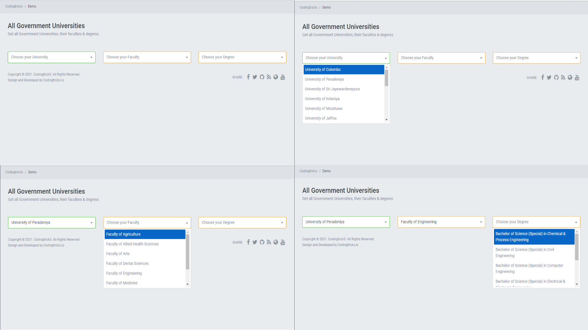

# Sri Lanka's Universities, Faculties, and Degrees.

This is the <a href="https://srilankan-universities-package.herokuapp.com/">demostration application</a> of <a href="dinushchathurya/srilankan-universities"> Srilnakn Universities </a>PHP Package Repository. In this package it's containf the all the Srilankan Government Universiities , their Faculties and Degree programs. Developers can use this, when they want to get the extractly Degree program based on the Faculty and University.



# Package Configuration

## Installation

`composer require dinushchathurya/srilankan-universities`

## Usage

```
use Devninja\University\University;

public function exampleFunction(){

    return University::getUniversities(); 
    return University::getFaculties('University');
    return University::getDegrees('Faculty');
}
```

## Working Demo

You can find the working demo of this PHP Package from <a href="https://srilankan-universities-package.herokuapp.com/">here</a>.

## Package Repository

You can obtain the source code this PHP Package from  <a href="https://github.com/dinushchathurya/srilankan-universities-faculties-degrees.git">here</a>.

## Packagist 

You can find it in Packagist from <a href="https://packagist.org/packages/dinushchathurya/srilankan-universities"> here</a>.

# Application Configuration

## Setup
 
```
$ git clone https://github.com/dinushchathurya/srilankan-universities
$ cd srilankan-universities
$ composer install
```
  - Duplicate and save .env.example as .env and fill in environment variables

## Run The Service
```
$ php artisan serve
```
## To add new Entity to Package
Navigate to <b>vendor->dinushchathurya->srilankan-universities->src->University.php</b> file and add your entity.

## Author
[Dinush Chathurya](https://dinushchathurya.github.io/)

## License

Copyright (c) 2020 <a href="https://dinushchathurya.github.io/">Dinush Chathurya</a> and <a href="https://codingtricks.io/">codingtricks.io</a>

Permission is hereby granted, free of charge, to any person obtaining
a copy of this software and associated documentation files (the
"Software"), to deal in the Software without restriction, including
without limitation the rights to use, copy, modify, merge, publish,
distribute, sublicense, and/or sell copies of the Software, and to
permit persons to whom the Software is furnished to do so, subject to
the following conditions:

The above copyright notice and this permission notice shall be
included in all copies or substantial portions of the Software.

THE SOFTWARE IS PROVIDED "AS IS", WITHOUT WARRANTY OF ANY KIND,
EXPRESS OR IMPLIED, INCLUDING BUT NOT LIMITED TO THE WARRANTIES OF
MERCHANTABILITY, FITNESS FOR A PARTICULAR PURPOSE AND
NONINFRINGEMENT. IN NO EVENT SHALL THE AUTHORS OR COPYRIGHT HOLDERS BE
LIABLE FOR ANY CLAIM, DAMAGES OR OTHER LIABILITY, WHETHER IN AN ACTION
OF CONTRACT, TORT OR OTHERWISE, ARISING FROM, OUT OF OR IN CONNECTION
WITH THE SOFTWARE OR THE USE OR OTHER DEALINGS IN THE SOFTWARE.

## Blog

https://codingtricks.io/

## Tutorial
https://codingtricks.io/ajax-dependent-university-faculty-degree-dropdown/

## 

<p ><h2 align="center">Happy<i class="fa fa-heart" style="color:red;"></i> Coding<i class="fa fa-code" style="color:orange;"> </i></h2></p>

